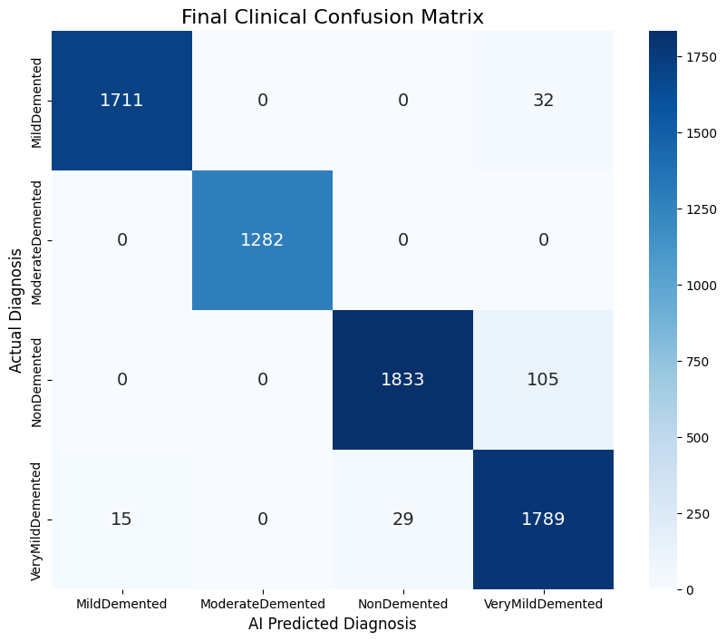
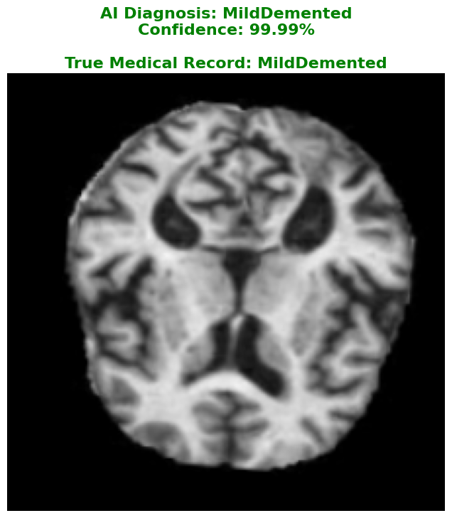

# Dual-Pathway-AlzheimerDetect-AI-Model

A Custom Dual-Pathway Deep Learning Architecture (DenseNet + EfficientNet) for 4-Class Alzheimer's MRI Detection. Achieved 97.34% accuracy with 1.00 Precision on severe cases.

![Real-World Inference Grid]

---

## 📊 Architecture Performance & Results

Standard single-pathway models struggle to process complex brain tissue textures without losing data. By engineering a Dual-Pathway ensemble, the AI processes both deep structural features (DenseNet) and broad tissue patterns (EfficientNet) simultaneously, resulting in a massive performance leap.

---

## 🏥 Clinical Evaluation Metrics

The final Phase 2 model was evaluated on unseen, real-world validation data. The model achieved a flawless precision score on severe cases and successfully routed around standard false-positive bottlenecks.

---

## 💻 Live Single-Patient Diagnosis

The finalized `.keras` brain is optimized for lightweight, real-time inference. Below is a live demonstration of the model predicting an unseen MRI scan on a standard CPU with zero computational bottleneck.

## 💾 Dataset & Reproducibility
The MRI scans used in this project are sourced from the publicly available Augmented Alzheimer MRI Dataset. (https://www.kaggle.com/datasets/uraninjo/augmented-alzheimer-mri-dataset)
* **Classes:** NonDemented, VeryMildDemented, MildDemented, ModerateDemented.
* **Format:** 224x224 RGB Images.

*Note: Due to GitHub's file size limits, the 97.34% pre-trained `.keras` model and the raw dataset are hosted externally. Please reach out for the Google Drive access links if you wish to run the live inference module.*
